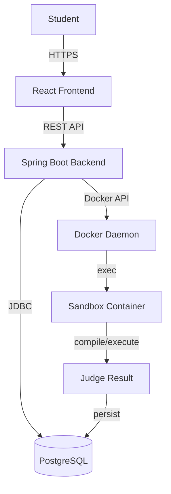
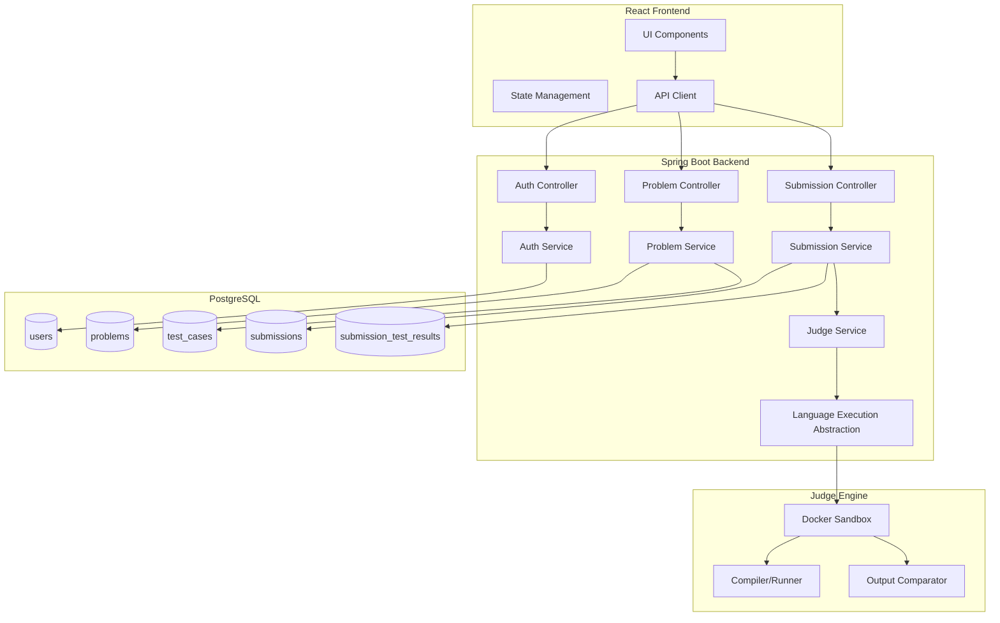
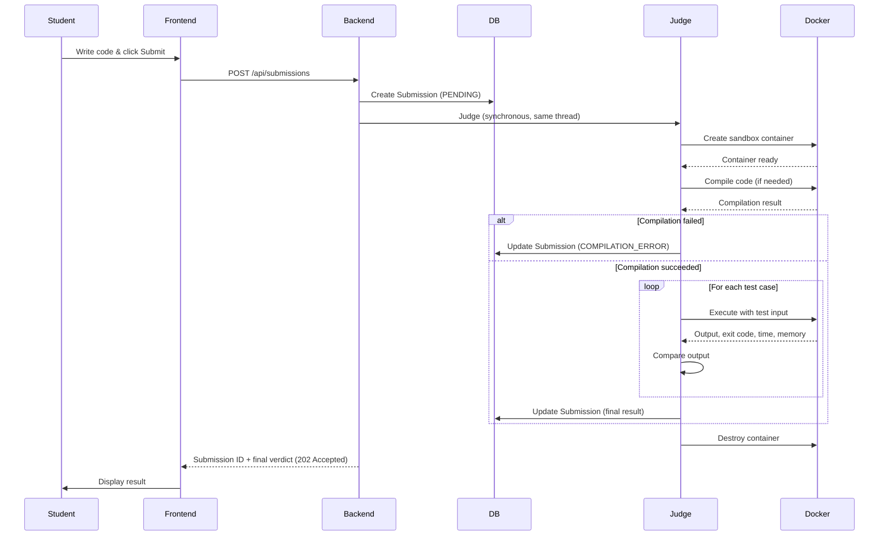
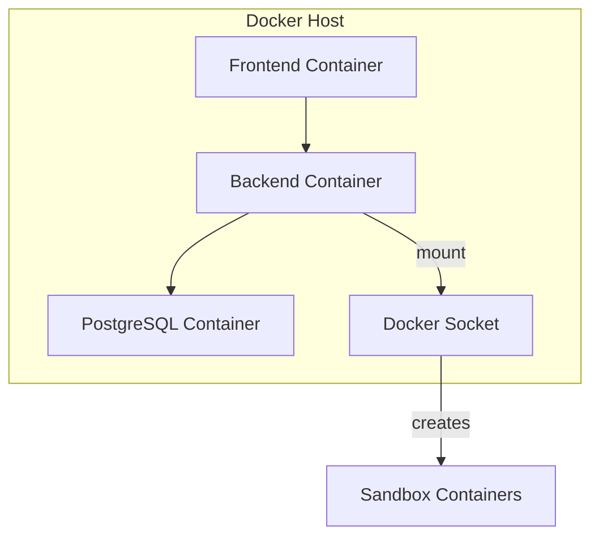

# ARCHITECTURE.md — CodingJudge Architecture

**Version:** 1.0
**Status:** Draft
**Last Updated:** 2026-10-02

---

## 1. Overview

CodingJudge uses a **modular monolith** architecture. A single Spring Boot backend serves the REST API and orchestrates the judge. The judge executes student code inside isolated Docker containers.

This architecture was chosen because:
- It is simpler to deploy and operate than a distributed system
- It avoids unnecessary infrastructure (Redis, message queues)
- It provides clear separation of concerns within a single codebase
- It can be decomposed later if scale demands it

---

## 2. System Context Diagram



---

## 3. Component Diagram



---

## 4. Frontend Architecture

### 4.1 Technology

- **React 18** with functional components and hooks
- **TypeScript** for type safety
- **Vite** for build tooling
- **React Router** for client-side routing

### 4.2 Structure

```
frontend/src/
├── components/          # Reusable UI components
│   ├── Layout/
│   ├── ProblemCard/
│   ├── CodeEditor/
│   ├── TestCaseResult/
│   └── SubmissionTable/
├── pages/               # Page-level components
│   ├── LoginPage/
│   ├── RegisterPage/
│   ├── ProblemListPage/
│   ├── ProblemDetailPage/
│   └── SubmissionHistoryPage/
├── api/                 # API client functions
│   ├── auth.ts
│   ├── problems.ts
│   └── submissions.ts
├── hooks/               # Custom React hooks
│   ├── useAuth.ts
│   ├── useTimer.ts
│   └── useSubmission.ts
├── types/               # TypeScript type definitions
│   └── index.ts
├── utils/               # Utility functions
│   └── helpers.ts
├── App.tsx
└── main.tsx
```

### 4.3 State Management

- Local component state via `useState` and `useReducer`
- React Context for authentication state
- No external state management library (keep it simple)

---

## 5. Backend Architecture

### 5.1 Technology

- **Spring Boot 3** with Java 17
- **Spring Security** for authentication
- **Spring Data JPA** for database access
- **Flyway** for database migrations
- **JWT** for stateless authentication

### 5.2 Structure

```
backend/src/main/java/com/codingjudge/
├── CodingJudgeApplication.java
├── config/
│   ├── SecurityConfig.java
│   ├── JwtConfig.java
│   └── DockerConfig.java
├── controller/
│   ├── AuthController.java
│   ├── ProblemController.java
│   └── SubmissionController.java
├── service/
│   ├── AuthService.java
│   ├── ProblemService.java
│   ├── SubmissionService.java
│   └── JudgeService.java
├── repository/
│   ├── UserRepository.java
│   ├── ProblemRepository.java
│   ├── TestCaseRepository.java
│   └── SubmissionRepository.java
├── model/
│   ├── entity/
│   │   ├── User.java
│   │   ├── Problem.java
│   │   ├── TestCase.java
│   │   ├── Submission.java
│   │   └── SubmissionTestResult.java
│   ├── dto/
│   │   ├── request/
│   │   └── response/
│   └── enums/
│       ├── SubmissionStatus.java
│       ├── Language.java
│       └── Difficulty.java
├── security/
│   ├── JwtTokenProvider.java
│   ├── JwtAuthenticationFilter.java
│   └── UserDetailsServiceImpl.java
├── judge/
│   ├── JudgeEngine.java
│   ├── LanguageExecutor.java
│   ├── DockerSandbox.java
│   ├── OutputComparator.java
│   ├── ExecutionResult.java
│   ├── CompilationResult.java
│   └── executor/
│       ├── JavaExecutor.java
│       ├── CppExecutor.java
│       └── PythonExecutor.java
└── exception/
    ├── GlobalExceptionHandler.java
    ├── ForbiddenException.java
    ├── ResourceNotFoundException.java
    ├── DuplicateResourceException.java
    └── PayloadTooLargeException.java
```

### 5.3 Layers

| Layer | Responsibility |
|-------|---------------|
| Controller | HTTP request handling, input validation, response formatting |
| Service | Business logic, transaction management |
| Repository | Database access via Spring Data JPA |
| Judge | Code execution, result determination |

---

## 6. Database

See [DATABASE.md](DATABASE.md) for the complete schema design.

---

## 7. Submission Flow



Judging runs on the request thread, so the `202 Accepted` response already
carries a final verdict. The frontend still polls `GET /api/submissions/{id}`,
which simply returns that same terminal state on the first call; this keeps the
contract valid if judging later moves to the worker described below.

---

## 8. Judge Worker

### 8.1 Design

The judge worker runs **inside the Spring Boot application** as a Spring-managed component. It processes submissions synchronously within the request thread for the initial implementation.

**Rationale:** Starting with synchronous processing keeps the architecture simple. If submission volume grows, the judge can be extracted to a separate worker with a message queue.

### 8.2 Judge Engine Responsibilities

1. Receive submission with source code, language, and test cases
2. Create a Docker container with resource limits
3. Copy source code into the container
4. Compile (if needed) using the language-specific executor
5. Execute the compiled program against each test case
6. Compare output with expected output
7. Determine the final result
8. Persist the result
9. Clean up the container

### 8.3 Language Execution Abstraction

```java
public interface LanguageExecutor {
    Language getLanguage();
    CompilationResult compile(String sourceCode, Path workDir);
    ExecutionResult execute(Path executable, String input, 
                            Duration timeout, int memoryLimitMb);
}
```

Each language implements this interface:
- `JavaExecutor` — compiles with `javac`, runs with `java`
- `CppExecutor` — compiles with `g++`, runs the binary
- `PythonExecutor` — runs with `python3` (no compilation)

---

## 9. Docker Sandbox

### 9.1 Container Configuration

| Setting | Value | Purpose |
|---------|-------|---------|
| Network | `none` | No network access |
| Memory | 256 MB (configurable) | Limit RAM usage |
| CPU | 1.0 core (configurable) | Limit CPU usage |
| Filesystem | Read-only (except `/tmp`) | Prevent host modification |
| Privileges | `--security-opt=no-new-privileges` | Prevent privilege escalation |
| Capabilities | `--cap-drop=ALL` | Drop all Linux capabilities |
| PID limit | `--pids-limit=64` | Prevent fork bombs |
| Timeout | 10 seconds (configurable) | Kill long-running processes |

### 9.2 Lifecycle

1. Create container with resource limits
2. Copy source code into container
3. Compile (if needed)
4. Execute against test cases
5. Capture output, exit code, runtime, memory
6. **Always** destroy container (even on failure)

---

## 10. Error Handling

### 10.1 API Errors

All API errors return a consistent format:

```json
{
  "success": false,
  "data": null,
  "error": {
    "code": "ERROR_CODE",
    "message": "Human-readable message",
    "details": {}
  }
}
```

### 10.2 Judge Errors

| Error | Handling |
|-------|----------|
| Docker daemon unavailable | Return `INTERNAL_ERROR` |
| Container creation failure | Return `INTERNAL_ERROR` |
| Compilation timeout | Return `COMPILATION_ERROR` |
| Execution timeout | Return `TIME_LIMIT_EXCEEDED` |
| Memory limit exceeded | Return `MEMORY_LIMIT_EXCEEDED` |
| Unexpected exception | Return `INTERNAL_ERROR` |

---

## 11. Security Boundaries

See [SECURITY.md](SECURITY.md) for complete security requirements.

Key boundaries:
- Student code runs ONLY inside Docker containers
- Containers have no network, limited resources, read-only filesystem
- Hidden test cases are NEVER sent to the frontend
- All API endpoints (except auth) require JWT authentication
- Users can only access their own submissions

---

## 12. Deployment Architecture



The backend container mounts the Docker socket to create sandbox containers. This is a security consideration — see SECURITY.md for mitigation strategies.
