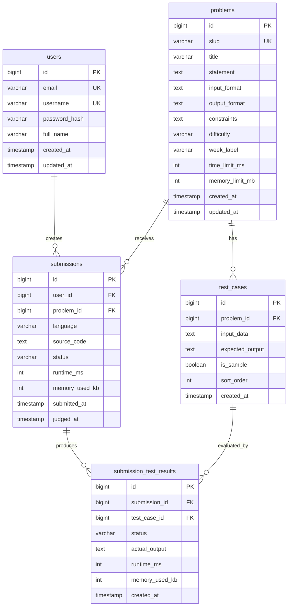

# DATABASE.md — CodingJudge Database Schema

**Version:** 1.0
**Status:** Draft
**Last Updated:** 2026-10-02

---

## 1. Overview

CodingJudge uses **PostgreSQL 16** as its primary database. Schema changes are managed through **Flyway migrations**.

---

## 2. Entity Relationship Diagram



---

## 3. Table Definitions

### 3.1 `users`

Stores student and professor accounts.

| Column | Type | Constraints | Description |
|--------|------|-------------|-------------|
| `id` | `BIGSERIAL` | `PRIMARY KEY` | Auto-incrementing ID |
| `email` | `VARCHAR(255)` | `UNIQUE NOT NULL` | User's email address |
| `username` | `VARCHAR(50)` | `UNIQUE NOT NULL` | Unique username |
| `password_hash` | `VARCHAR(255)` | `NOT NULL` | BCrypt hashed password |
| `full_name` | `VARCHAR(255)` | `NOT NULL` | User's full name |
| `role` | `VARCHAR(20)` | `NOT NULL DEFAULT 'STUDENT'` | `STUDENT` or `PROFESSOR` |
| `created_at` | `TIMESTAMP` | `NOT NULL DEFAULT NOW()` | Account creation time |
| `updated_at` | `TIMESTAMP` | `NOT NULL DEFAULT NOW()` | Last update time |

**Indexes:**
- `idx_users_email` on `email` (unique)
- `idx_users_username` on `username` (unique)

---

### 3.2 `problems`

Stores programming problems.

| Column | Type | Constraints | Description |
|--------|------|-------------|-------------|
| `id` | `BIGSERIAL` | `PRIMARY KEY` | Auto-incrementing ID |
| `slug` | `VARCHAR(100)` | `UNIQUE NOT NULL` | URL-friendly identifier |
| `title` | `VARCHAR(255)` | `NOT NULL` | Problem title |
| `statement` | `TEXT` | `NOT NULL` | Full problem statement (Markdown) |
| `input_format` | `TEXT` | `NOT NULL` | Description of input format |
| `output_format` | `TEXT` | `NOT NULL` | Description of output format |
| `constraints` | `TEXT` | | Problem constraints |
| `difficulty` | `VARCHAR(20)` | `NOT NULL` | `EASY`, `MEDIUM`, `HARD` |
| `week_label` | `VARCHAR(50)` | `NOT NULL` | e.g., `Week 1`, `Week 2` |
| `time_limit_ms` | `INTEGER` | `NOT NULL DEFAULT 2000` | Execution time limit (ms) |
| `memory_limit_mb` | `INTEGER` | `NOT NULL DEFAULT 256` | Memory limit (MB) |
| `created_at` | `TIMESTAMP` | `NOT NULL DEFAULT NOW()` | Creation time |
| `updated_at` | `TIMESTAMP` | `NOT NULL DEFAULT NOW()` | Last update time |

**Indexes:**
- `idx_problems_slug` on `slug` (unique)
- `idx_problems_week_label` on `week_label`
- `idx_problems_difficulty` on `difficulty`

---

### 3.3 `test_cases`

Stores test cases for each problem. Sample test cases are visible to students; hidden test cases are not.

| Column | Type | Constraints | Description |
|--------|------|-------------|-------------|
| `id` | `BIGSERIAL` | `PRIMARY KEY` | Auto-incrementing ID |
| `problem_id` | `BIGINT` | `NOT NULL REFERENCES problems(id) ON DELETE CASCADE` | Parent problem |
| `input_data` | `TEXT` | `NOT NULL` | Test input |
| `expected_output` | `TEXT` | `NOT NULL` | Expected output |
| `is_sample` | `BOOLEAN` | `NOT NULL DEFAULT FALSE` | Whether visible to students |
| `sort_order` | `INTEGER` | `NOT NULL DEFAULT 0` | Display/execution order |
| `created_at` | `TIMESTAMP` | `NOT NULL DEFAULT NOW()` | Creation time |

**Indexes:**
- `idx_test_cases_problem_id` on `problem_id`
- `idx_test_cases_is_sample` on `is_sample`

---

### 3.4 `submissions`

Stores student code submissions.

| Column | Type | Constraints | Description |
|--------|------|-------------|-------------|
| `id` | `BIGSERIAL` | `PRIMARY KEY` | Auto-incrementing ID |
| `user_id` | `BIGINT` | `NOT NULL REFERENCES users(id) ON DELETE CASCADE` | Submitting user |
| `problem_id` | `BIGINT` | `NOT NULL REFERENCES problems(id) ON DELETE CASCADE` | Target problem |
| `language` | `VARCHAR(20)` | `NOT NULL` | `JAVA`, `CPP`, `PYTHON` |
| `source_code` | `TEXT` | `NOT NULL` | Submitted source code |
| `status` | `VARCHAR(30)` | `NOT NULL DEFAULT 'PENDING'` | Judging status |
| `runtime_ms` | `INTEGER` | | Total runtime (ms) |
| `memory_used_kb` | `INTEGER` | | Memory used (KB) |
| `submitted_at` | `TIMESTAMP` | `NOT NULL DEFAULT NOW()` | Submission time |
| `judged_at` | `TIMESTAMP` | | When judging completed |

**Indexes:**
- `idx_submissions_user_id` on `user_id`
- `idx_submissions_problem_id` on `problem_id`
- `idx_submissions_status` on `status`
- `idx_submissions_submitted_at` on `submitted_at`

---

### 3.5 `submission_test_results`

Stores per-test-case results for each submission.

| Column | Type | Constraints | Description |
|--------|------|-------------|-------------|
| `id` | `BIGSERIAL` | `PRIMARY KEY` | Auto-incrementing ID |
| `submission_id` | `BIGINT` | `NOT NULL REFERENCES submissions(id) ON DELETE CASCADE` | Parent submission |
| `test_case_id` | `BIGINT` | `NOT NULL REFERENCES test_cases(id) ON DELETE CASCADE` | Test case |
| `status` | `VARCHAR(30)` | `NOT NULL` | Result for this test case |
| `actual_output` | `TEXT` | | Program's actual output |
| `runtime_ms` | `INTEGER` | | Runtime for this test (ms) |
| `memory_used_kb` | `INTEGER` | | Memory for this test (KB) |
| `created_at` | `TIMESTAMP` | `NOT NULL DEFAULT NOW()` | Creation time |

**Indexes:**
- `idx_submission_test_results_submission_id` on `submission_id`
- `idx_submission_test_results_test_case_id` on `test_case_id`

---

## 4. Enums

### 4.1 Submission Status

| Value | Description |
|-------|-------------|
| `PENDING` | Submission received, not yet judged |
| `JUDGING` | Currently being judged |
| `ACCEPTED` | All test cases passed |
| `WRONG_ANSWER` | Output did not match expected |
| `COMPILATION_ERROR` | Source code failed to compile |
| `RUNTIME_ERROR` | Program crashed during execution |
| `TIME_LIMIT_EXCEEDED` | Execution exceeded time limit |
| `MEMORY_LIMIT_EXCEEDED` | Execution exceeded memory limit |
| `INTERNAL_ERROR` | Judge infrastructure failure |

### 4.2 Language

| Value | Description |
|-------|-------------|
| `JAVA` | Java 17 |
| `CPP` | C++17 |
| `PYTHON` | Python 3.11 |

### 4.3 Difficulty

| Value | Description |
|-------|-------------|
| `EASY` | Easy problems |
| `MEDIUM` | Medium problems |
| `HARD` | Hard problems |

---

## 5. Relationships

```
users 1 ──── n submissions
problems 1 ──── n test_cases
problems 1 ──── n submissions
submissions 1 ──── n submission_test_results
test_cases 1 ──── n submission_test_results
```

---

## 6. Migrations

Database schema is managed through Flyway migrations located in:
```
backend/src/main/resources/db/migration/
```

Migration naming convention: `V{version}__{description}.sql`

Example:
- `V1__create_users_table.sql`
- `V2__create_problems_table.sql`
- `V3__create_test_cases_table.sql`
- `V4__create_submissions_table.sql`
- `V5__create_submission_test_results_table.sql`

---

## 7. Data Retention

- **Submissions**: Retained indefinitely (students need long-term history)
- **Test cases**: Retained indefinitely (needed for re-judging)
- **Users**: Retained indefinitely
- **Problems**: Retained indefinitely

---

## 8. Backup Strategy

- Daily automated backups of PostgreSQL
- Backups retained for 30 days
- Point-in-time recovery enabled via WAL archiving
