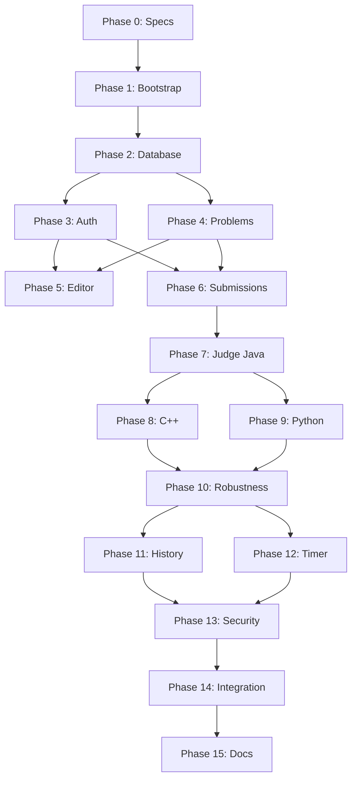

# DEVELOPMENT_PLAN.md — CodingJudge Phased Implementation Plan

**Version:** 1.0
**Status:** All phases complete
**Last Updated:** 2026-10-02

---

## Overview

This plan breaks the project into small, independently testable phases. Each phase produces a working, testable increment.

---

## Phase 0 — Repository and Specifications ✅

**Status:** Complete

**Deliverables:**
- [x] AGENTS.md
- [x] CLAUDE.md
- [x] README.md
- [x] .gitignore
- [x] .env.example
- [x] docker-compose.yml
- [x] docs/PRODUCT_SPEC.md
- [x] docs/ARCHITECTURE.md
- [x] docs/DATABASE.md
- [x] docs/API_SPEC.md
- [x] docs/JUDGE_DESIGN.md
- [x] docs/SECURITY.md
- [x] docs/DEVELOPMENT_PLAN.md

**Validation:**
- [x] All documents are consistent with each other
- [x] No contradictions between specs
- [x] All required sections present

---

## Phase 1 — Project Bootstrap

**Status:** Complete (2026-10-02)

**Goal:** Set up the basic project structure and verify everything starts.

**Deliverables:**
- [x] React + TypeScript + Vite frontend scaffold
- [x] Spring Boot 3 + Java 17 backend scaffold
- [x] PostgreSQL 16 running via Docker Compose
- [x] Docker development environment configured
- [x] Basic health check endpoint

**Acceptance Criteria:**
- [x] Frontend dev server starts on port 3000
- [x] Backend starts on port 8080
- [x] PostgreSQL is accessible
- [x] Health check returns 200

---

## Phase 2 — Database

**Status:** Complete (2026-10-02)

**Goal:** Implement the database schema with migrations.

**Deliverables:**
- [x] Flyway migrations for all tables
- [x] JPA entities: User, Problem, TestCase, Submission, SubmissionTestResult
- [x] Spring Data JPA repositories
- [x] Database integration tests

**Acceptance Criteria:**
- [x] All migrations run successfully
- [x] Entities map correctly to tables
- [x] Repositories pass integration tests
- [x] Foreign key constraints work correctly

---

## Phase 3 — Authentication

**Status:** Complete (2026-10-02)

**Goal:** Implement login, register, and current-user endpoints.

**Deliverables:**
- [x] JWT token provider
- [x] Spring Security configuration
- [x] Auth controller (register, login, me)
- [x] Password hashing with BCrypt
- [x] Auth integration tests

**Acceptance Criteria:**
- [x] User can register
- [x] User can log in and receive JWT
- [x] Protected endpoints reject unauthenticated requests
- [x] Users cannot access other users' data
- [x] Passwords are never stored in plaintext

---

## Phase 4 — Problem Browsing

**Status:** Complete (2026-10-02)

**Goal:** Implement problem list and problem detail endpoints.

**Deliverables:**
- [x] Problem controller (list, get by slug)
- [x] Problem service with search and filter
- [x] Sample test case retrieval
- [x] Problem browsing integration tests

**Acceptance Criteria:**
- [x] Students can list problems
- [x] Students can search problems
- [x] Students can filter by week/difficulty
- [x] Students can view problem details
- [x] Students can see sample test cases
- [x] Hidden test cases are never exposed

---

## Phase 5 — Code Editor

**Status:** Complete (2026-10-02) — Run and Submit both live-verified once the Phase 6/7 backend landed

**Goal:** Build the online code editor frontend.

**Deliverables:**
- [x] Code editor component with syntax highlighting
- [x] Language selector (Java, C++, Python)
- [x] Starter code templates
- [x] Run Code button
- [x] Submit Code button
- [x] Test case result display

**Acceptance Criteria:**
- [x] Editor supports Java, C++, Python
- [x] Syntax highlighting works
- [x] Language selector switches templates
- [x] Run Code shows results
- [x] Submit Code shows submission status

---

## Phase 6 — Submission Pipeline

**Status:** Complete (2026-10-02)

**Goal:** Implement submission creation and persistence.

**Deliverables:**
- [x] Submission controller (create, get, list)
- [x] Submission service
- [x] Submission persistence
- [x] Submission pipeline integration tests

**Acceptance Criteria:**
- [x] Students can submit code
- [x] Submissions are persisted
- [x] Students can view their submission history
- [x] Students can view submission details
- [x] Students cannot view others' submissions

---

## Phase 7 — Judge Engine (Java)

**Status:** Complete (2026-10-02) — core landed in Phase 7 and was live-verified against a real Docker daemon in Phase 10

**Core Deliverables Complete:**
- DockerSandbox with resource limits (CPU, memory, pids, readonly fs, no network)
- LanguageExecutor abstraction + JavaExecutor (javac/java)
- OutputComparator with token-based comparison
- JudgeEngine orchestrating compile → execute per test case → compare → persist
- SubmissionService integration: judge() called on submit
- TestJudgeConfig with mock DockerSandbox for test profile

**Known Issues:**
- Integration tests blocked by test environment (no Docker daemon, low memory causing VM crashes)
- Repository tests pass (18/18)
- Core judge engine compiles and is ready for live validation when Docker is available

**Goal:** Implement Docker-based judge for Java.

**Deliverables:**
- [ ] Docker sandbox implementation
- [ ] Language executor abstraction
- [ ] Java executor
- [ ] Output comparator
- [ ] Judge engine integration tests

**Acceptance Criteria:**
- [ ] Correct Java solution → ACCEPTED
- [ ] Incorrect Java solution → WRONG_ANSWER
- [ ] Invalid Java source → COMPILATION_ERROR
- [ ] Java program crash → RUNTIME_ERROR
- [ ] Java infinite loop → TIME_LIMIT_EXCEEDED
- [ ] Java excessive memory → MEMORY_LIMIT_EXCEEDED
- [ ] Containers are cleaned up after execution

---

## Phase 8 — C++ Support

**Status:** Complete (2026-10-02)

**Goal:** Add C++ execution through the language abstraction.

**Deliverables:**
- [x] C++ executor
- [x] C++ judge tests

**Acceptance Criteria:**
- [x] Correct C++ solution → ACCEPTED
- [x] Incorrect C++ solution → WRONG_ANSWER
- [x] Invalid C++ source → COMPILATION_ERROR
- [x] C++ program crash → RUNTIME_ERROR
- [x] C++ infinite loop → TIME_LIMIT_EXCEEDED
- [x] C++ excessive memory → MEMORY_LIMIT_EXCEEDED
- [ ] Incorrect C++ solution → WRONG_ANSWER
- [ ] Invalid C++ source → COMPILATION_ERROR
- [ ] C++ program crash → RUNTIME_ERROR
- [ ] C++ infinite loop → TIME_LIMIT_EXCEEDED

---

## Phase 9 — Python Support

**Status:** Complete (2026-10-02)

**Goal:** Add Python execution through the language abstraction.

**Deliverables:**
- [x] Python executor
- [x] Python judge tests

**Acceptance Criteria:**
- [x] Correct Python solution → ACCEPTED
- [x] Incorrect Python solution → WRONG_ANSWER
- [x] Python runtime error → RUNTIME_ERROR
- [x] Python infinite loop → TIME_LIMIT_EXCEEDED
- [x] Python excessive memory → MEMORY_LIMIT_EXCEEDED

---

## Phase 10 — Judge Robustness

**Status:** Complete (2026-10-02) — validated end-to-end against a real Docker daemon

**Goal:** Test all edge cases and result types.

**Deliverables:**
- [x] Comprehensive judge test suite (JudgeEngineTest — 8 tests; OutputComparatorTest — 17; LanguageExecutorContractTest — 4)
- [x] Edge case tests (large input, malformed output, whitespace rules)
- [x] Repeated submission tests (verified 4x live, no leaks)
- [x] Process cleanup verification (0 leftover containers after live runs)

**Acceptance Criteria:**
- [x] All 7 result types tested (live, all three languages)
- [x] Multiple sample tests work
- [x] Multiple hidden tests work
- [x] Large input handled correctly
- [x] Malformed output handled correctly
- [x] Repeated submissions work
- [x] Containers are always cleaned up

**Bugs found and fixed during live validation** are recorded in
`docs/JUDGE_DESIGN.md` section 11.6.

---

## Phase 11 — Submission History

**Status:** Complete (2026-10-02)

**Goal:** Implement submission history UI.

**Deliverables:**
- [x] Submission history page (paginated table with status badges)
- [x] Submission detail view (metadata, metrics, sample results)
- [x] Source code viewer (read-only, syntax highlighted)

**Acceptance Criteria:**
- [x] Students can view their submission history
- [x] Each submission shows problem, language, status, runtime, memory, time
- [x] Students can view submitted source code
- [x] Hidden test case contents are not shown

**Notes:**
- The judge previously left `runtimeMs`, `memoryUsedKb` and `judgedAt` unset, so
  every row rendered as unknown. The judge now records wall-clock runtime,
  peak memory (cgroup `memory.peak`) and the judged timestamp, reporting the
  worst case across test cases.
- Verified live: list excludes `sourceCode`; detail returns source and only
  sample test results; hidden test inputs are absent from both responses.

---

## Phase 12 — Practice Timer

**Status:** Complete (2026-10-02)

**Goal:** Implement optional practice timer.

**Deliverables:**
- [x] Timer component (HH:MM:SS display, start/pause/reset)
- [x] Start/pause/reset functionality
- [x] Timer persistence — intentionally omitted; timer resets on reload

**Acceptance Criteria:**
- [x] Timer displays elapsed time (HH:MM:SS)
- [x] Students can start, pause, reset
- [x] Timer does not affect judging
- [x] Timer is optional

**Notes:**
- The timer is entirely client-side and is never included in a submission
  payload. `submissions.test.ts` asserts the request body contains exactly
  `problemId`, `language` and `sourceCode`.
- Practice time and the judge's execution time limit are unrelated concepts and
  are never mixed. See `docs/PRODUCT_SPEC.md` section 9.

---

## Phase 13 — Security Hardening

**Status:** Complete (2026-10-02)

**Goal:** Review and harden security.

**Deliverables:**
- [x] Security audit (code review + live adversarial testing)
- [x] Penetration testing (11 sandbox escape attempts, 10 API checks)
- [x] Security test suite (`ApiSecurityTest`, 13 tests)
- [x] Documentation update (`docs/SECURITY.md` sections 9-11)

**Acceptance Criteria:**
- [x] All security tests pass (93 backend tests green)
- [x] No critical vulnerabilities
- [x] Sandbox escape tests pass (all 11 attempts contained)
- [x] API security tests pass

**Issues found and fixed:**
- Submissions above ~90 KB failed silently (exec argument limit) — writes are
  now chunked. Verified 14 KB to 215 KB all succeed.
- Stale `Submission.testResults` collection made the detail endpoint return an
  empty test list — now read through the repository.

**Remaining risk:** no rate limiting on login or submission endpoints. Recorded
in `docs/SECURITY.md` section 11.

---

## Phase 14 — Integration Testing

**Status:** Complete (2026-10-02)

**Goal:** Test the complete user flow end-to-end.

**Deliverables:**
- [x] End-to-end integration tests (`FullUserFlowIntegrationTest`, 18 tests)
- [x] Full user flow tests, plus live verification against real Docker

**Acceptance Criteria:**
- [x] Register → Login → Browse → Solve → Run → Submit → View Result → View History
- [x] All flows work correctly
- [x] All edge cases handled

**Issues found and fixed:**
- `POST /api/submissions/run` was specified in `docs/API_SPEC.md` and called by
  the editor's Run button, but was never implemented. The Run button returned
  404 for every click. Implemented, and it now runs against sample test cases
  only without creating a submission.
- Compiler diagnostics and runtime stack traces were discarded: `JudgeEngine`
  stored only the stdout stream, while all errors arrive on stderr. A failed
  submission showed an empty output box. Both now surface to the student.

Both were invisible to unit tests and only surfaced by exercising the flow.

---

## Phase 15 — Documentation and Cleanup

**Status:** Complete (2026-10-02)

**Goal:** Finalize documentation and clean up.

**Deliverables:**
- [x] Updated README (status, working build and test commands, judge flow)
- [x] Updated technical docs (ARCHITECTURE, API_SPEC, DATABASE, JUDGE_DESIGN, SECURITY)
- [x] Code cleanup (no TODO/FIXME/stub markers left in production source)
- [x] Final validation (111 backend, 82 frontend, type-check and build clean)

**Acceptance Criteria:**
- [x] All documentation is up to date
- [x] All tests pass
- [x] No TODO comments in code
- [x] Code follows conventions

**Corrections made to documentation that had drifted from the code:**

- `README.md` claimed the project was in Phase 0, told developers to run
  `./mvnw` (there is no Maven wrapper), and documented Python judge tests under
  `judge/` (that directory is empty; the judge is Java inside the backend).
- `CLAUDE.md` repeated the `mvnw` and Python judge commands and listed
  directories that do not exist.
- `AGENTS.md` described a `judge/` service and a `tests/` tree that were never
  built.
- `API_SPEC.md`, `ARCHITECTURE.md`, `JUDGE_DESIGN.md` and `DATABASE.md`
  described asynchronous judging and a `PENDING → JUDGING → verdict` state
  machine. Judging is synchronous and `JUDGING` is never written, so the
  diagrams and the example response were misleading. All now state the actual
  behaviour and record that `JUDGING` is reserved for the future worker.
- `ARCHITECTURE.md` referenced `exception/CustomExceptions.java` and omitted
  `ExecutionResult`/`CompilationResult`; the package tree now matches the code.

**Standing guidance added:** judge changes must be verified against real Docker,
not only the stubbed test suite. Several defects in this project passed every
unit test and were found only by live submission.

---

## Post-Plan: Frontend UI Test Coverage

All sixteen phases above were complete when a coverage gap was noticed: every one
of the ten components and pages shipped without a single DOM-level test. The 37
existing frontend tests covered only the API client and pure utilities, which is
why the missing `/submissions/run` endpoint survived from Phase 5 until Phase 14.

Added Testing Library and jsdom, plus DOM tests for the pages and components:

| File | Tests | Covers |
|------|-------|--------|
| `pages/ProblemDetailPage.test.tsx` | 10 | Run vs Submit endpoints, verdict rendering, compiler diagnostics, language switching |
| `pages/SubmissionHistoryPage.test.tsx` | 8 | Row rendering, status wording, pagination, load failure |
| `pages/LoginPage.test.tsx` | 6 | Sign-in, token storage, error handling, retry |
| `components/PracticeTimer.test.tsx` | 10 | Start, pause, resume, reset, unmount cleanup, formatting |
| `components/TestCaseResults.test.tsx` | 11 | Status labels, output display, empty states |

**Bug found and fixed:** the practice timer discarded all elapsed time when a
student paused and resumed. `start` reset the baseline to the current instant
without banking the previous span, so any session with a pause under-reported,
and could report less time than the sum of its segments. It was introduced in
Phase 12 and never exercised in a browser, so the whole phase passed its own
acceptance criteria with the defect present. Fixed by accumulating banked time
across segments in `usePracticeTimer`.

The regression guard was mutation-checked: restoring the old `/submissions` URL
for the run call fails two tests, and restoring the fixed timer fails the resume
test.

---

## Dependency Graph

---

## Risk Register

| Risk | Impact | Likelihood | Mitigation |
|------|--------|------------|------------|
| Docker sandbox escape | Critical | Low | Follow security best practices, regular audits |
| Judge too slow | Medium | Medium | Optimize container startup, use pre-built images |
| Hidden test exposure | High | Medium | Strict API design, integration tests |
| Scope creep | Medium | Medium | Follow spec, no speculative features |
| Database performance | Low | Medium | Proper indexing, query optimization |
