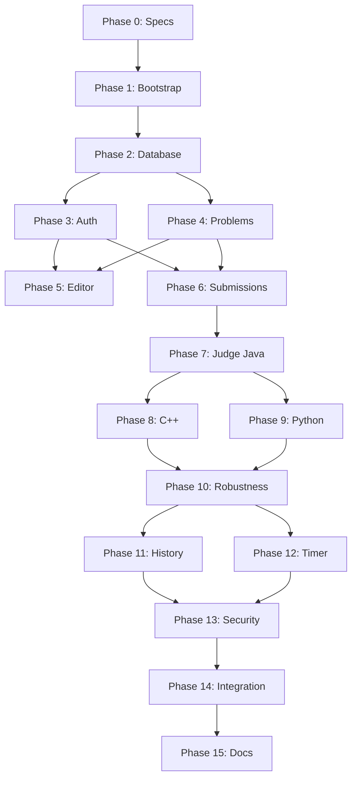

# DEVELOPMENT_PLAN.md — CodingJudge Phased Implementation Plan

**Version:** 1.0
**Status:** Draft
**Last Updated:** 2026-10-02

---

## Overview

This plan breaks the project into small, independently testable phases. Each phase produces a working, testable increment.

---

## Phase 0 — Repository and Specifications ✅

**Status:** Complete

**Deliverables:**
- [x] AGENTS.md
- [x] CLAUDE.md
- [x] README.md
- [x] .gitignore
- [x] .env.example
- [x] docker-compose.yml
- [x] docs/PRODUCT_SPEC.md
- [x] docs/ARCHITECTURE.md
- [x] docs/DATABASE.md
- [x] docs/API_SPEC.md
- [x] docs/JUDGE_DESIGN.md
- [x] docs/SECURITY.md
- [x] docs/DEVELOPMENT_PLAN.md

**Validation:**
- [x] All documents are consistent with each other
- [x] No contradictions between specs
- [x] All required sections present

---

## Phase 1 — Project Bootstrap

**Status:** Not Started

**Goal:** Set up the basic project structure and verify everything starts.

**Deliverables:**
- [ ] React + TypeScript + Vite frontend scaffold
- [ ] Spring Boot 3 + Java 17 backend scaffold
- [ ] PostgreSQL 16 running via Docker Compose
- [ ] Docker development environment configured
- [ ] Basic health check endpoint

**Acceptance Criteria:**
- [ ] Frontend dev server starts on port 3000
- [ ] Backend starts on port 8080
- [ ] PostgreSQL is accessible
- [ ] Health check returns 200

---

## Phase 2 — Database

**Status:** Not Started

**Goal:** Implement the database schema with migrations.

**Deliverables:**
- [ ] Flyway migrations for all tables
- [ ] JPA entities: User, Problem, TestCase, Submission, SubmissionTestResult
- [ ] Spring Data JPA repositories
- [ ] Database integration tests

**Acceptance Criteria:**
- [ ] All migrations run successfully
- [ ] Entities map correctly to tables
- [ ] Repositories pass integration tests
- [ ] Foreign key constraints work correctly

---

## Phase 3 — Authentication

**Status:** Not Started

**Goal:** Implement login, register, and current-user endpoints.

**Deliverables:**
- [ ] JWT token provider
- [ ] Spring Security configuration
- [ ] Auth controller (register, login, me)
- [ ] Password hashing with BCrypt
- [ ] Auth integration tests

**Acceptance Criteria:**
- [ ] User can register
- [ ] User can log in and receive JWT
- [ ] Protected endpoints reject unauthenticated requests
- [ ] Users cannot access other users' data
- [ ] Passwords are never stored in plaintext

---

## Phase 4 — Problem Browsing

**Status:** Not Started

**Goal:** Implement problem list and problem detail endpoints.

**Deliverables:**
- [ ] Problem controller (list, get by slug)
- [ ] Problem service with search and filter
- [ ] Sample test case retrieval
- [ ] Problem browsing integration tests

**Acceptance Criteria:**
- [ ] Students can list problems
- [ ] Students can search problems
- [ ] Students can filter by week/difficulty
- [ ] Students can view problem details
- [ ] Students can see sample test cases
- [ ] Hidden test cases are never exposed

---

## Phase 5 — Code Editor

**Status:** Not Started

**Goal:** Build the online code editor frontend.

**Deliverables:**
- [ ] Code editor component with syntax highlighting
- [ ] Language selector (Java, C++, Python)
- [ ] Starter code templates
- [ ] Run Code button
- [ ] Submit Code button
- [ ] Test case result display

**Acceptance Criteria:**
- [ ] Editor supports Java, C++, Python
- [ ] Syntax highlighting works
- [ ] Language selector switches templates
- [ ] Run Code shows results
- [ ] Submit Code shows submission status

---

## Phase 6 — Submission Pipeline

**Status:** Not Started

**Goal:** Implement submission creation and persistence.

**Deliverables:**
- [ ] Submission controller (create, get, list)
- [ ] Submission service
- [ ] Submission persistence
- [ ] Submission pipeline integration tests

**Acceptance Criteria:**
- [ ] Students can submit code
- [ ] Submissions are persisted
- [ ] Students can view their submission history
- [ ] Students can view submission details
- [ ] Students cannot view others' submissions

---

## Phase 7 — Judge Engine (Java)

**Status:** Not Started

**Goal:** Implement Docker-based judge for Java.

**Deliverables:**
- [ ] Docker sandbox implementation
- [ ] Language executor abstraction
- [ ] Java executor
- [ ] Output comparator
- [ ] Judge engine integration tests

**Acceptance Criteria:**
- [ ] Correct Java solution → ACCEPTED
- [ ] Incorrect Java solution → WRONG_ANSWER
- [ ] Invalid Java source → COMPILATION_ERROR
- [ ] Java program crash → RUNTIME_ERROR
- [ ] Java infinite loop → TIME_LIMIT_EXCEEDED
- [ ] Java excessive memory → MEMORY_LIMIT_EXCEEDED
- [ ] Containers are cleaned up after execution

---

## Phase 8 — C++ Support

**Status:** Not Started

**Goal:** Add C++ execution through the language abstraction.

**Deliverables:**
- [ ] C++ executor
- [ ] C++ judge tests

**Acceptance Criteria:**
- [ ] Correct C++ solution → ACCEPTED
- [ ] Incorrect C++ solution → WRONG_ANSWER
- [ ] Invalid C++ source → COMPILATION_ERROR
- [ ] C++ program crash → RUNTIME_ERROR
- [ ] C++ infinite loop → TIME_LIMIT_EXCEEDED

---

## Phase 9 — Python Support

**Status:** Not Started

**Goal:** Add Python execution.

**Deliverables:**
- [ ] Python executor
- [ ] Python judge tests

**Acceptance Criteria:**
- [ ] Correct Python solution → ACCEPTED
- [ ] Incorrect Python solution → WRONG_ANSWER
- [ ] Python runtime error → RUNTIME_ERROR
- [ ] Python infinite loop → TIME_LIMIT_EXCEEDED

---

## Phase 10 — Judge Robustness

**Status:** Not Started

**Goal:** Test all edge cases and result types.

**Deliverables:**
- [ ] Comprehensive judge test suite
- [ ] Edge case tests (large input, malformed output, etc.)
- [ ] Repeated submission tests
- [ ] Process cleanup verification

**Acceptance Criteria:**
- [ ] All 7 result types tested
- [ ] Multiple sample tests work
- [ ] Multiple hidden tests work
- [ ] Large input handled correctly
- [ ] Malformed output handled correctly
- [ ] Repeated submissions work
- [ ] Containers are always cleaned up

---

## Phase 11 — Submission History

**Status:** Not Started

**Goal:** Implement submission history UI.

**Deliverables:**
- [ ] Submission history page
- [ ] Submission detail view
- [ ] Source code viewer

**Acceptance Criteria:**
- [ ] Students can view their submission history
- [ ] Each submission shows problem, language, status, runtime, memory, time
- [ ] Students can view submitted source code
- [ ] Hidden test case contents are not shown

---

## Phase 12 — Practice Timer

**Status:** Not Started

**Goal:** Implement optional practice timer.

**Deliverables:**
- [ ] Timer component
- [ ] Start/pause/reset functionality
- [ ] Timer persistence (optional)

**Acceptance Criteria:**
- [ ] Timer displays elapsed time (HH:MM:SS)
- [ ] Students can start, pause, reset
- [ ] Timer does not affect judging
- [ ] Timer is optional

---

## Phase 13 — Security Hardening

**Status:** Not Started

**Goal:** Review and harden security.

**Deliverables:**
- [ ] Security audit
- [ ] Penetration testing
- [ ] Security test suite
- [ ] Documentation update

**Acceptance Criteria:**
- [ ] All security tests pass
- [ ] No critical vulnerabilities
- [ ] Sandbox escape tests pass
- [ ] API security tests pass

---

## Phase 14 — Integration Testing

**Status:** Not Started

**Goal:** Test the complete user flow end-to-end.

**Deliverables:**
- [ ] End-to-end integration tests
- [ ] Full user flow tests

**Acceptance Criteria:**
- [ ] Register → Login → Browse → Solve → Run → Submit → View Result → View History
- [ ] All flows work correctly
- [ ] All edge cases handled

---

## Phase 15 — Documentation and Cleanup

**Status:** Not Started

**Goal:** Finalize documentation and clean up.

**Deliverables:**
- [ ] Updated README
- [ ] Updated technical docs
- [ ] Code cleanup
- [ ] Final validation

**Acceptance Criteria:**
- [ ] All documentation is up to date
- [ ] All tests pass
- [ ] No TODO comments in code
- [ ] Code follows conventions

---

## Dependency Graph

---

## Risk Register

| Risk | Impact | Likelihood | Mitigation |
|------|--------|------------|------------|
| Docker sandbox escape | Critical | Low | Follow security best practices, regular audits |
| Judge too slow | Medium | Medium | Optimize container startup, use pre-built images |
| Hidden test exposure | High | Medium | Strict API design, integration tests |
| Scope creep | Medium | Medium | Follow spec, no speculative features |
| Database performance | Low | Medium | Proper indexing, query optimization |
