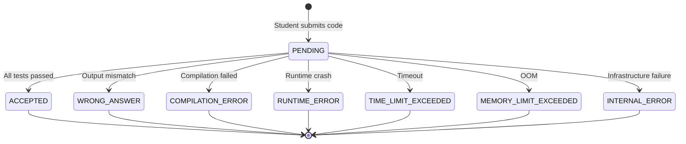
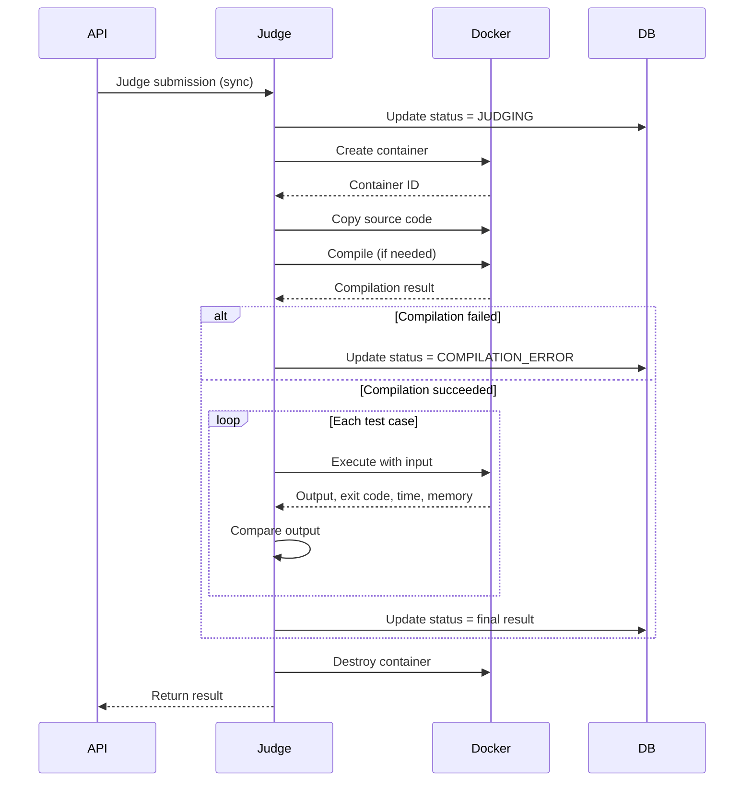
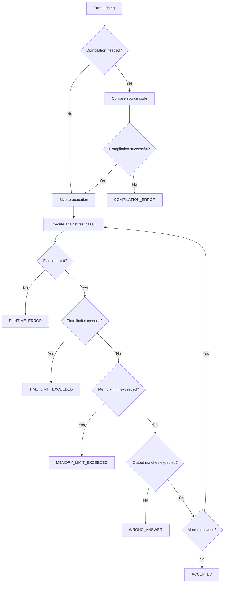

# JUDGE_DESIGN.md — CodingJudge Judge Engine Design

**Version:** 1.0
**Status:** Draft
**Last Updated:** 2026-10-02

---

## 1. Overview

The judge is the core of CodingJudge. It executes untrusted student code inside isolated Docker containers, compares output against expected results, and determines the submission status.

---

## 2. Submission Lifecycle



Judging is synchronous, so a submission is only ever observed as `PENDING` or
as a final verdict; the intermediate `JUDGING` state is retained in the enum for
the queue-backed worker described in `ARCHITECTURE.md` section 8 but is never
written today.

### States

| State | Description |
|-------|-------------|
| `PENDING` | Submission created, not yet judged |
| `JUDGING` | Reserved for the asynchronous worker; never written today |
| `ACCEPTED` | All test cases passed |
| `WRONG_ANSWER` | At least one test case output mismatch |
| `COMPILATION_ERROR` | Source code failed to compile |
| `RUNTIME_ERROR` | Program crashed during execution |
| `TIME_LIMIT_EXCEEDED` | Execution exceeded time limit |
| `MEMORY_LIMIT_EXCEEDED` | Execution exceeded memory limit |
| `INTERNAL_ERROR` | Judge infrastructure failure |

---

## 3. Job Lifecycle

For the initial implementation, jobs are processed **synchronously** within the request thread.



---

## 4. Compile Lifecycle

### 4.1 Compiled Languages (Java, C++)

1. Source code is written to a file inside the container
2. Compiler is invoked with appropriate flags
3. Compilation output (stdout/stderr) is captured
4. Exit code is checked:
   - `0` → Compilation succeeded
   - non-zero → Compilation failed → `COMPILATION_ERROR`

### 4.2 Interpreted Languages (Python)

No compilation step. The source code is executed directly.

---

## 5. Execution Lifecycle

For each test case:

1. Input data is written to a file or piped to stdin
2. Program is executed with resource limits
3. stdout and stderr are captured
4. Exit code is checked
5. Execution time and memory usage are recorded
6. Output is compared with expected output

---

## 6. Docker Sandbox

### 6.1 Container Configuration

```yaml
Image: codingjudge/sandbox:latest
Network: none
Memory: 256m
CPU: 1.0
PidsLimit: 64
SecurityOpt:
  - no-new-privileges:true
CapDrop:
  - ALL
ReadonlyRootfs: true
Tmpfs:
  /tmp: size=64m
```

### 6.2 Resource Limits

| Resource | Default | Configurable | Purpose |
|----------|---------|--------------|---------|
| Memory | 256 MB | Yes | Prevent OOM attacks |
| CPU | 1.0 core | Yes | Prevent CPU exhaustion |
| Processes | 64 | Yes | Prevent fork bombs |
| Time | 10 sec | Yes | Kill long-running programs |
| Output | 64 KB | Yes | Prevent output flooding |
| Disk | 64 MB (tmpfs) | Yes | Limit filesystem usage |

### 6.3 Security Measures

- **No network access** — Container cannot reach the internet or internal network
- **Read-only root filesystem** — Cannot modify system files
- **No new privileges** — Cannot escalate privileges
- **All capabilities dropped** — No Linux capabilities
- **PID limit** — Prevents fork bombs
- **No Docker socket access** — Cannot control Docker daemon
- **No access to environment variables** — Cannot read secrets

---

## 7. Language Adapters

### 7.1 Language Execution Abstraction

```java
public interface LanguageExecutor {
    Language getLanguage();
    CompilationResult compile(String sourceCode, Path workDir);
    ExecutionResult execute(Path executable, String input, 
                            Duration timeout, int memoryLimitMb);
}
```

### 7.2 Java Adapter

| Setting | Value |
|---------|-------|
| Source file | `Main.java` |
| Compile command | `javac Main.java` |
| Execute command | `java Main` |
| Timeout | Problem time limit |
| Memory | Problem memory limit |

### 7.3 C++ Adapter

| Setting | Value |
|---------|-------|
| Source file | `main.cpp` |
| Compile command | `g++ -std=c++17 -O2 -o main main.cpp` |
| Execute command | `./main` |
| Timeout | Problem time limit |
| Memory | Problem memory limit |

### 7.4 Python Adapter

| Setting | Value |
|---------|-------|
| Source file | `main.py` |
| Compile command | None (interpreted) |
| Execute command | `python3 main.py` |
| Timeout | Problem time limit |
| Memory | Problem memory limit |

---

## 8. Output Comparison

### 8.1 Standard Comparison Strategy

The judge uses a **token-based comparison** strategy:

1. Split both actual and expected output into tokens (whitespace-separated)
2. Compare token by token
3. All tokens must match exactly

This handles:
- Trailing whitespace (ignored)
- Trailing newlines (ignored)
- Multiple spaces between tokens (normalized)
- Blank lines (ignored)

### 8.2 Comparison Rules

| Scenario | Result |
|----------|--------|
| Exact match | ACCEPTED |
| Different tokens | WRONG_ANSWER |
| Extra tokens in actual | WRONG_ANSWER |
| Missing tokens in actual | WRONG_ANSWER |
| Different order | WRONG_ANSWER |

### 8.3 Future Extensibility

The output comparator is an interface, allowing custom checkers to be added later:

```java
public interface OutputComparator {
    ComparisonResult compare(String expected, String actual);
}
```

---

## 9. Result Determination

### 9.1 Decision Flow



### 9.2 Result Mapping

| Condition | Result |
|-----------|--------|
| Compiler exit code ≠ 0 | `COMPILATION_ERROR` |
| Program exit code ≠ 0 | `RUNTIME_ERROR` |
| Execution time > time limit | `TIME_LIMIT_EXCEEDED` |
| Memory usage > memory limit | `MEMORY_LIMIT_EXCEEDED` |
| Output ≠ expected output | `WRONG_ANSWER` |
| All tests passed | `ACCEPTED` |
| Docker/infrastructure failure | `INTERNAL_ERROR` |

---

## 10. Cleanup After Execution

### 10.1 Container Cleanup

Containers are **always** destroyed after execution, regardless of outcome:

```java
try {
    // Execute and judge
} finally {
    dockerClient.removeContainerCmd(containerId)
        .withForce(true)
        .withRemoveVolumes(true)
        .exec();
}
```

### 10.2 Resource Cleanup

- Temporary files are stored in Docker volumes and removed with the container
- No files are written to the host filesystem
- Database records persist (submission + results)

---

## 11. Error Handling

### 11.1 Docker Errors

| Error | Result |
|-------|--------|
| Docker daemon unavailable | `INTERNAL_ERROR` |
| Image not found | `INTERNAL_ERROR` |
| Container creation failed | `INTERNAL_ERROR` |
| Container execution failed | `INTERNAL_ERROR` |

### 11.2 Timeout Handling

- A watchdog timer kills the container if execution exceeds the time limit
- The container is force-removed
- Result is set to `TIME_LIMIT_EXCEEDED`

### 11.3 Memory Handling

- Docker's memory limit is enforced at the OS level
- If the program exceeds the limit, the OOM killer terminates it
- The exit code indicates OOM
- Result is set to `MEMORY_LIMIT_EXCEEDED`

---

## 11.5 Live End-to-End Verification

The full chain — API submit, container creation, source injection, compile,
execution across all test cases, output comparison, result persistence — was
validated against a real Docker daemon on 2026-10-02:

| Scenario | Language | Result |
|----------|----------|--------|
| Correct solution | JAVA / CPP / PYTHON | `ACCEPTED` |
| Incorrect output | JAVA / CPP | `WRONG_ANSWER` |
| Invalid source | CPP | `COMPILATION_ERROR` |
| Uncaught exception (divide by zero) | JAVA | `RUNTIME_ERROR` |
| Infinite loop | JAVA / CPP / PYTHON | `TIME_LIMIT_EXCEEDED` |
| Memory exhaustion | JAVA / PYTHON | `MEMORY_LIMIT_EXCEEDED` |
| Repeated submissions (4x) | CPP | All `ACCEPTED`, 0 leftover containers |

## 11.6 Implementation Constraints Discovered

These Docker behaviours forced specific implementation choices and are easy to
regress. Each was found by live validation, not review:

1. **`docker cp` cannot write into a read-only rootfs.** The archive API rejects
   writes with "container rootfs is marked read-only" even when the target is a
   writable tmpfs mount. Source is written with a `base64 -d` exec instead.
2. **exec stdin is unreliable.** Streaming input through docker-java's async exec
   ends with "The pipe has been ended". Test input is written to `/tmp/input.txt`
   and redirected: `sh -c "<run cmd> < /tmp/input.txt"`.
3. **A container must be kept alive.** The image's default `CMD` exits
   immediately, so every later exec fails with "container is not running". The
   judge creates containers with `tail -f /dev/null`.
4. **Compilation must happen in the same container** that later runs the program;
   otherwise the produced class files/binaries do not exist at execution time.
5. **`/workspace` and `/tmp` need `exec` in their tmpfs options**, otherwise a
   compiled C++ binary fails with "Permission denied".
6. **Interpreted languages must skip compilation.** An empty compile command
   produces an invalid exec ("executable file not found in $PATH"). The
   `LanguageExecutor.requiresCompilation()` hook controls this.
7. **Kill and remove must be attempted independently.** If a container already
   exited, `kill` throws and would skip `remove`, leaking the container.
8. **Out-of-memory is usually not exit code 137.** Runtimes report OOM themselves
   and exit non-zero (the JVM exits 1). The judge matches stderr signatures
   (`OutOfMemoryError`, `MemoryError`, `bad_alloc`) in addition to 137.
9. **docker-java 3.x needs an explicit HTTP transport.** Without it the client
   throws "dockerCmdExecFactory was not specified" on first use.
10. **A class with two constructors needs `@Autowired`** on the DI constructor,
    otherwise Spring silently uses the no-arg one and injects nulls.
11. **An exec command cannot carry a whole submission.** Base64 inflates source by
    a third, and past roughly 90 KB the shell rejects the argument list (exit 255).
    Files are staged in 24 000-character chunks and decoded in place.

---

## 11.7 Two Entry Points, One Verdict Engine

`JudgeEngine` exposes two ways in, both built on the same private
`executeAgainst` loop so verdict rules can never drift apart:

| Entry point | Test cases used | Persists | Used by |
|-------------|-----------------|----------|---------|
| `judge(submission)` | All of them | Yes: one `Submission` plus a result row per case | Submit |
| `runSamples(problem, source, language)` | Sample cases only | No | Run |

`runSamples` is what makes "Run" safe: hidden test cases are never loaded into
the execution loop, so no amount of probing can reveal them, and no submission
row is created, so iterating in the editor cannot pollute history.

**Error output is visible.** Compiler diagnostics and stack traces arrive on the
container's stderr, not stdout. `visibleOutput` falls back to the error stream
when stdout is blank, which is what turns `COMPILATION_ERROR` and
`RUNTIME_ERROR` from an empty box into something a student can act on.

Live verification (2026-10-02, real Docker sandbox, problem `sum-two`):

| Check | Result |
|-------|--------|
| `POST /api/submissions/run` for JAVA / CPP / PYTHON | `ACCEPTED` in all three |
| Submission count before and after a run | Unchanged (74 → 74) |
| Run response test-case count | 1, the sample only |
| Hidden input/output present in run response | Absent |
| Compilation error message returned | `Main.java:1: error: ';' expected` |
| Python traceback returned | Full traceback included |
| Submit, detail and history after the refactor | `ACCEPTED`, 1 visible result, history updated |

---

## 12. Performance Considerations

| Concern | Mitigation |
|---------|------------|
| Container startup time | Use pre-built images, keep images small |
| Concurrent submissions | Docker handles isolation; monitor resource usage |
| Large test suites | Execute tests sequentially within one container |
| Disk usage | Containers are ephemeral; volumes are removed |

---

## 13. Testing Requirements

The judge MUST be tested for:

1. Correct solution → `ACCEPTED`
2. Incorrect solution → `WRONG_ANSWER`
3. Invalid source → `COMPILATION_ERROR`
4. Program crash → `RUNTIME_ERROR`
5. Infinite loop → `TIME_LIMIT_EXCEEDED`
6. Excessive memory → `MEMORY_LIMIT_EXCEEDED`
7. Multiple sample tests
8. Multiple hidden tests
9. Java execution
10. C++ execution
11. Python execution
12. Submission persistence
13. Result persistence
14. Repeated submissions
15. Cleanup after execution
